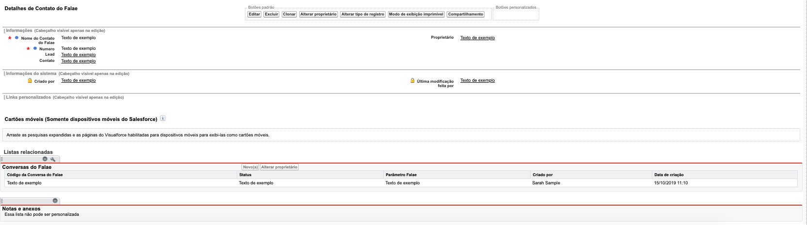

##########################
Layout de Contato do Falae
##########################

Na seção de layout do Contato do Falae encontramos um layout padrão. 
O layout padrão do Contato do Falae apresenta os campos e botões abaixo abaixo:

    
Campos com um cadeado são campos de apenas leitura. Campos marcados com asterisco são
Definição dos campos:
  
  
.. Important::
    - Definição dos campos:
     - Nome do Contato do Falae: Nome que foi dado ao contato do Falae cadastrado
     - Numero: Numero que foi cadastrado ao contato do Falae
     - Lead: Lead vinculado ao contato do Falaep
     - Contato: Contato vinculado ao contato do Falae
     - Proprietário: Criador da o contato do Falae
