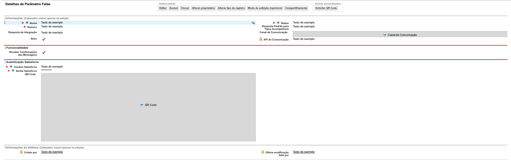

#################
Layout de Parâmetro Falae Web
#################

Na seção de layout do Parâmetro Falae encontramos dois layouts padrões, um para cada uma das APIs do Whatsapp. 
O layout padrão do Parâmetro Falae Web apresenta os campos e botões abaixo abaixo:

    
Campos com um cadeado são campos de apenas leitura. Campos marcados com asterisco são requerido.

.. Important::
   - Definição dos campos:
    -  Descrição: a descrição seria o nome do Parâmetro Falae.
    -  Número: número registrado no whatsapp a máscara seria DDD+Número. Ex.: 13999887766.
    -  Resposta padrão para tipos incompatíveis: resposta para quando enviarem alguma mensagem que não foi possível interpretar (imagens, áudio, sticker, etc…).
    -  Ativo: quando ativo deixa o número conectado para o recebimento e envio de mensagens. (Na criação de um parâmetro que já será utilizado deixe ativado na criação).
    -  Usuário Salesforce: seu usuário de login no salesforce.
    -  Senha Salesforce: sua senha mais a chave de segurança.
    -  QRCode: QRCode a ser escaneado para conectar o celular a aplicação
    -  Canal de Comunicação: informa qual o canal de comunicação está sendo utilizado neste parâmetro. Ex.: Whatsapp
    -  API de Comunicação: informa qual a API de comunicação está sendo utilizado. Ex.: Inpulso Web
    -  Receber Confirmação de Leitura: configura a confirmação de visualização da mensagem por parte do cliente
