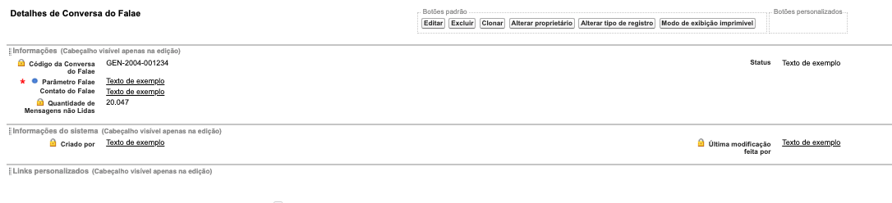

###############################
Layout do Conversa do Falae
###############################

Na seção de layout do objeto Conversa do Falae encontramos um layout padrão. 
O layout padrão do Conversa do Falae apresenta os campos e botões abaixo abaixo:

    
Campos com um cadeado são campos de apenas leitura.

.. Important::
   - Definição dos campos:
    - Código da Conversa do Falae: Campo de nome da mensagem, um número gerado automaticamente através de uma mascara
    - Status: Status da conversa
    - Parâmetro Falae: Código do parâmetro cadastrado
    - Contrato do Falae: Contato cadastrado
    - Quantidade de Mensagens não Lidas: Mensagens que não foram visualizados
