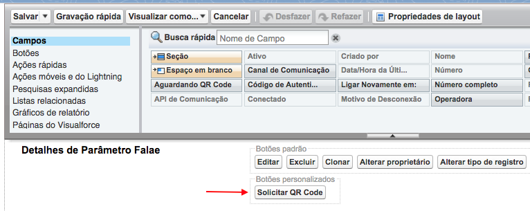
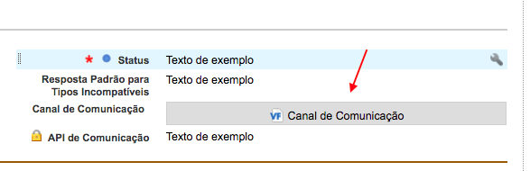
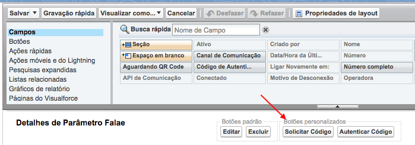
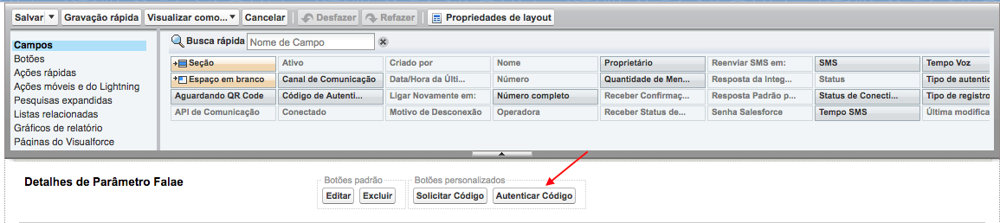
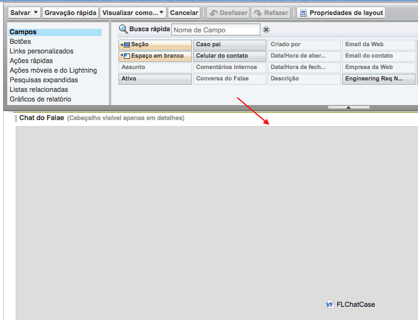
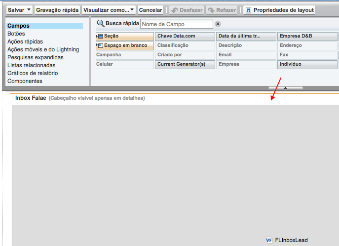
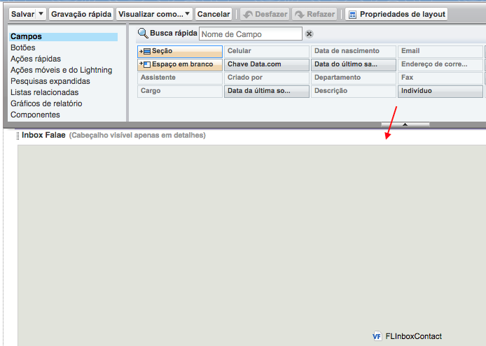
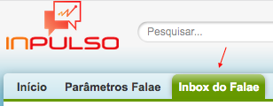

#######################
Páginas do Visualforce
#######################
Para acessar os Componentes do Visualforce:

Entre em Configuração.

.. image:: configurcao.png
    :width: 200px
    :alt: Solidity logo
    :align: center
    
Escreva páginas na busca rápida e clique em Páginas do Visualforce.

Nele constará as seguintes páginas do visualforce ligado ao pacote instalado:

.. image:: paginasVisualforce1.png
    :width: 450px
    :alt: Solidity logo
    :align: center
  
FLHostControl
-------------
O FLHostControl é utilizado para pegar o host da org.

QR Code
---------
O QR Code é campo utilizado no **Layout de Parâmetro Falae** do objeto **Parâmetro Falae**, nele é apresentado o QR Code para conectar o whatsapp no servidor.

.. image:: paginasVisualforce2.png
    :width: 700px
    :alt: Solidity logo
    :align: center
 
FLQrRequest
-----------
O FLQrRequest é um botão personalizado utilizado no **Layout de Parâmetro Falae** do objeto **Parâmetro Falae**, ao clicar nele, solicita um QR Code ao servidor.

    
Canal de Comunicação
---------
O Canal de Comunicação é campo utilizado no **Layout de Parâmetro Falae** do objeto **Parâmetro Falae**, nele é apresentado o tipo de comunicação.

 
FLSolicitarCodigo
---------
O FLSolicitarCodigo é botão utilizado no **Layout de Parâmetro Falae (Whatsapp - Inpulso Mob)** do objeto **Parâmetro Falae**, ele é utilizado para solicitar um novo código.

FLAutenticarNumero
---------
O FLAutenticarNumero é botão utilizado no **Layout de Parâmetro Falae (Whatsapp - Inpulso Mob)** do objeto **Parâmetro Falae**, ele é utilizado para autenticar o código recebido do parâmetro do tipo **Whatsapp - Inpulso Mob**.

FLChatCase
---------
O FLChatCase é componente utilizado no **Case Layout - Sample Falae** do objeto **Caso**, ele é utilizado para adicionar o **Chat do Falae** da conversa relacionada ao **Caso**.

FLInboxLead
---------
O FLInboxLead é componente utilizado no **Lead Layout - Sample Falae** do objeto **Lead**, ele é utilizado para adicionar o **Inbox do Falae** das conversas relacionadas ao **Lead**.

FLInboxContact
---------
O FLInboxContact é componente utilizado no **Contact Layout - Sample Falae** do objeto **Contato**, ele é utilizado para adicionar o **Inbox do Falae** das conversas relacionadas ao **Contato**.

FLInboxUser
---------
O FLInboxUser é uma guia utilizada na aplicação do Falae para o Salesforce Classic. Através dessa guia é possível utilizar as funções do inbox na versão classic do Salesforce.

FLSfdcActionControl
---------
O FLSfdcActionControl é utilizado para pegar o link de novos objetos.

