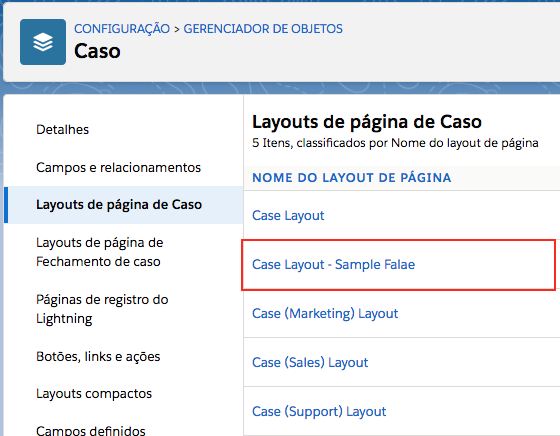
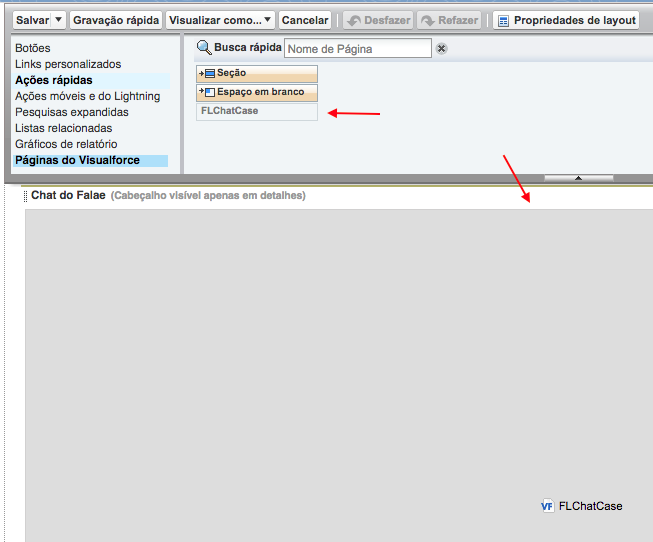
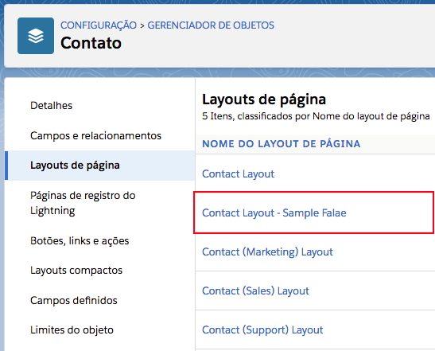
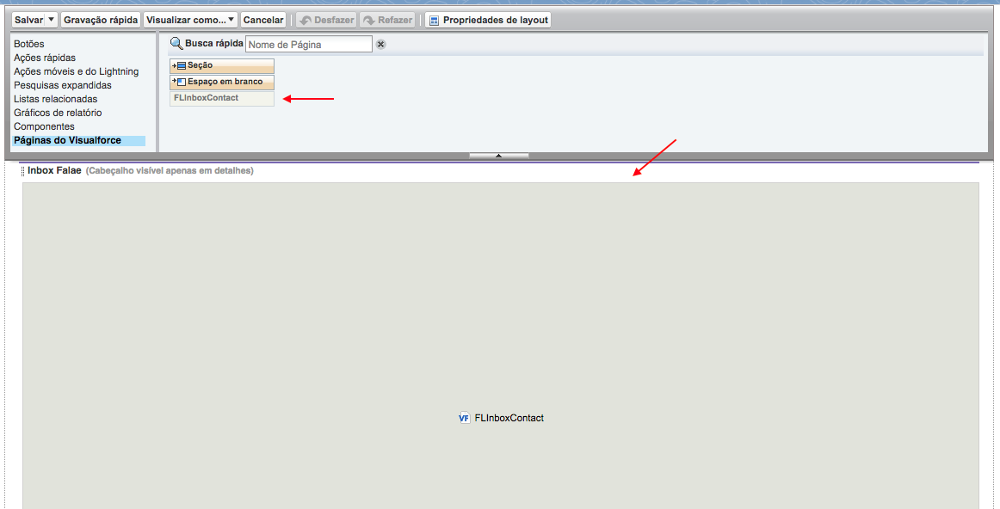
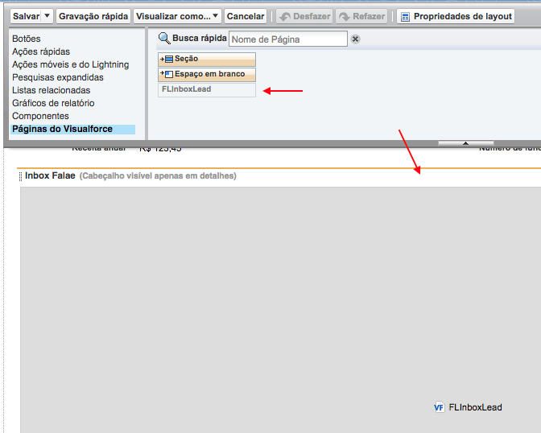

#################
Layouts de exemplo do Falae
#################

Alguns objetos apresentam layouts de exemplo disponíveis após a instalacao do pacote, sendo estes layouts de exemplos formas de mostrar a utilizacao de recursos destes objetos, sendo eles Caso, Contato e Lead.

Caso -> Case Layout - Sample Falae
-----------------------

    Layouts da páginas.

No objeto Caso, temos o exemplo de Layout mostrando como implementar o **Chat do Falae** caso tenha alguma conversa vinculada com o objeto.

    Exemplo de utilização da Página do Visualforce - **FLChatCase**.

Contato -> Contact Layout - Sample Falae
-----------------------

    Layouts da páginas.

No objeto Contato, temos o exemplo de Layout mostrando como implementar o **Inbox do Falae** caso tenha alguma conversa vinculada com o objeto.

    Exemplo de utilização da Página do Visualforce - **FLInboxContact**.

Lead -> Lead Layout - Sample Falae
-----------------------

.. figure:: img/sampleLayout5.png
    :width: 500px
    :alt: Solidity logo
    :align: center

    Layouts da páginas.

No objeto Lead, temos o exemplo de Layout mostrando como implementar o **Inbox do Falae** caso tenha alguma conversa vinculada com o objeto.

    Exemplo de utilização da Página do Visualforce - **FLInboxLead**.

