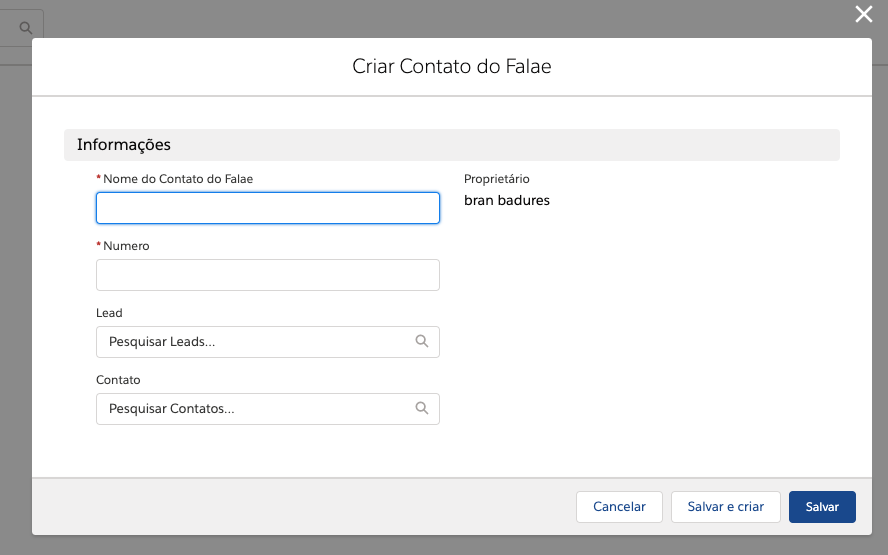
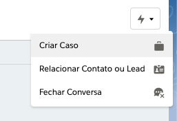
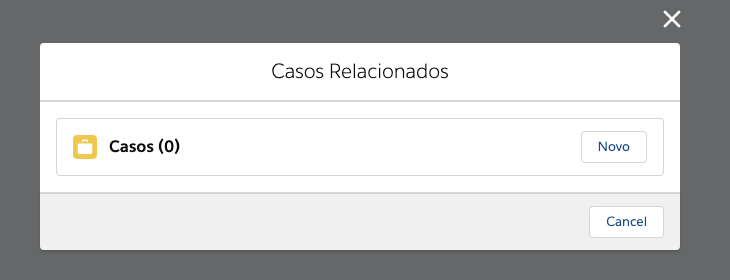
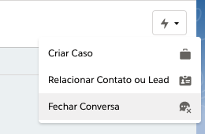

#################
Inbox do Falae
#################

O Inbox do Falae é acessado através da barra superior. Acessando-a é possível realizar as seguintes ações:

Abrindo uma Conversa
~~~~~~~~~~~~~~~~~~~~~~~~~~~~~~

Uma conversa pode ser iniciada através do Falae de direção Empresa para Cliente utilizando o botão "Iniciar Conversa" no canto superior direito.

.. figure:: Inbox9.png
    :width: 250px
    :alt: Solidity logo
    :align: center
    
    Botão de Iniciar Conversa

Um modal será aberto onde poderá ser selecionado um Contato Falae para iniciar a conversa.

.. figure:: Inbox10.png
    :width: 500px
    :alt: Solidity logo
    :align: center
    
    Modal de inicio de conversa

Criando um Contato Falae
~~~~~~~~~~~~~~~~~~~~~~~~~~~~~~

Um Contato Falae também pode ser criado através deste modal, pesquisando pelo Contato Inexistente e selecionado a opção "Pesquisar Nome no Contato Falae"

.. figure:: Inbox11.png
    :width: 500px
    :alt: Solidity logo
    :align: center
    
    Pesquisa de Contato através do modal
    
Após a seleção deste botão, um outro modal poderá ser aberto onde a opção de criar um Contato Falae estará disponível ao pesquisar um contato inexistente.

.. figure:: Inbox12.png
    :width: 500px
    :alt: Solidity logo
    :align: center
  
    Selecionar a opção "Criar Contato Falae"
    
Ao selecionar a opção de Criar Contato Falae o modal para entrar com as informações deste novo contato aparecerá na tela.

  
    Menu de criação do novo Contato Falae

Selecionar Conversa
~~~~~~~~~~~~~~~~~~~~~~~~~~~~~~

.. image:: Inbox1.png
    :width: 500px
    :alt: Solidity logo
    :align: center
    
    Barra superior da tela
    
Através da barra lateral esquerda pode-se pode-se selecionar qual conversa abrir. Através da conversa é possível ler as mensagens enviadas e responder ao cliente.

Vincular/Desvincular Conversa
~~~~~~~~~~~~~~~~~~~~~~~~~~~~~~

Dentro da conversa é possível vinculá-la a um lead ou uma conta através do botão apresentado no canto superior direito da mesma.

.. figure:: Inbox2.png
    :width: 625px
    :alt: Solidity logo
    :align: center
    
    Selecionando botão de ações
    
Ao seleciona-lo um painel aparecerá na conversa, onde será possível selecionar se a conversa deve ser relacionada a um Lead ou a um Contato

.. figure:: Inbox3.png
    :width: 500px
    :alt: Solidity logo
    :align: center
    
    Painel de vinculação/desvinculação
 
 
A desviculação da conversa é realizada através deste painel em uma conversa que já esteja vinculada. Para desvincular deve-se clicar no X onde está o nome da Conta/Lead e salvar, assim voltando para como seria no início da conversa

.. figure:: Inbox5.png
    :width: 450px
    :alt: Solidity logo
    :align: center
    
    Ações a serem realizadas

A criação de uma Conta/Lead pode também ser realizada através deste painel. Ao pesquisar por um registro inexistente uma caixa de diálogo aparecerá, ao clicar nela um painel de pesquisa e criação de Conta/Lead será aberto, dependendo do que estiver sido selecionado previamente.

.. figure:: Inbox6.png
    :width: 500px
    :alt: Solidity logo
    :align: center
    
    Busca por um Contato/Lead que não existe

.. figure:: Inbox7.png
    :width: 650px
    :alt: Solidity logo
    :align: center
    
    Seleção da opção Criar Lead/Criar Contato

.. figure:: Inbox8.png
    :width: 650px
    :alt: Solidity logo
    :align: center
    
    Painel de criação de Contato/Lead
    
Após a criação a Conta/Lead pode ser vinculada a Conversa

Criação de Caso
~~~~~~~~~~~~~~~~~~~~~~~~~~~~~~
Um caso pode ser aperto durante a conversa utilizando o botão de ações que se encontra no canto superior direito da conversa.

    
    Opção de Abrir Caso

Ao realizar esta ação um modal será aberto, onde o usuário poderá criar um Caso ao Selecionar o botão "Novo"

    
    Criação de Caso

Fechando uma Conversa
~~~~~~~~~~~~~~~~~~~~~~~~~~~~~~
Uma conversa pode ser fechada através do botão de ações encontrado no canto superior direito da conversa. Ao selecionar a opção de Fechar Conversa uma mensagem de confirmação será mostrada em tela e a conversa será fechada imediatamente.

    
    Opção de Fechar Conversa

