#################
Setup
#################

O objetivo deste documento é apontar os requisitos necessários e o passo-a-passo para a aplicação da funcionalidade e sua configuração em uma nova organização.

Registro de Domínio para a Organização
-----------------------

Para que o pacote possa ser baixado primariamente o usuário deve possuir uma organização no SalesForce que possua o domínio cadastrado. Para cadastrar um domínio o mesmo deve, através da barra de pesquisa acessada pelo botão Configuração, procurar por "Meu Domínio"

.. figure:: instalacao4.png
    :width: 250px
    :alt: Solidity logo
    :align: center
    
    Barra de pesquisa das configurações

Caso não tenha domínio cadastrado, deve-se escolher um nome para o domínio e verificar a validade do mesmo.

.. figure:: instalacao6.png
    :width: 620px
    :alt: Solidity logo
    :align: center
    
    Registro de domínio

Após a validação confirmada, registrar o domínio do mesmo. Após o registro concluído, o SalesForce pedirá para que logue novamente. 

Após logar vá para a tela do "Meu domínio" novamente e clique em "Efetuar login".

.. figure:: instalacao5.png
    :width: 600px
    :alt: Solidity logo
    :align: center

Efetuado login, clique em "Implantar para usuários".

.. figure:: instalacao10.png
    :width: 600px
    :alt: Solidity logo
    :align: center
    
Tendo realizado estas ações, já com o domínio registrado, poderá seguir para a instalação do pacote

Instalação do Pacote Gerenciado
-----------------------
Em caso de procedimento interno o link para download pode ser encontrado através do Gerenciador de Pacotes. Para acessa-lo é preciso abrir as Configurações

.. figure:: configurcao.png	
    :width: 270px
    :alt: Solidity logo
    :align: center

E procurar por "Gerenciador de pacote". No Gerenciador de pacote é possível verificar as versões da aplicação e seu link de download

O download do pacote para a sua organização deve ser realizado através do link abaixo
         
         https://login.salesforce.com/packaging/installPackage.apexp?p0=04t3i000002WaOv
         
O login na sua organização será requerido, e após o a realização será automaticamente redirecionado para a tela de download do pacote, onde será necessário marcar as opções apresentadas abaixo:

.. figure:: instalacao1.png
    :width: 620px
    :alt: Solidity logo
    :align: center
    
    Seleção de instalação para todos os perfis

Logo após a confirmação uma notificação aparecerá, sendo necessária a confirmação do seguinte item:
   
.. figure:: instalacao2.png
    :width: 620px
    :alt: Solidity logo
    :align: center
    
    Garantia de acesso
    
Depois da confirmação das opções anteriores o download começará normalmente, demorando entre 1 a 3 minutos. Após a confirmação do encerramento do download a apliacação já estará visível para o cliente através dos aplicativos do SalesForce.

.. figure:: instalacao3.png
    :width: 620px
    :alt: Solidity logo
    :align: center
    
    Painel de aplicações
        
Configuração de Endpoints do Servidor
-----------------------

Após a configuração do domínio e a instalação do pacote WhatsappCore é necessário entrar em contato com a INPULSO para utilização do pacote. Entre em contato conosco.

Com a url que a INPULSO disponibilizar terá que inserir no Parâmetro Global e no Site Remoto.

Parâmetro Global
~~~~~~~~~~~~

Entre na Configuração

.. figure:: configurcao.png
    :width: 350px
    :alt: Solidity logo
    :align: center
    
    Seleção de Configurações
    
Escreva metadados na busca rápida e clique em Tipos de metadados personalizados.
Clique em Gerenciar registros do lado esquerdo do Parâmetro Global.
Clique em Novo.
Crie o parâmetro global para o WhatsappMob conforme a tabela abaixo:

+----------------------------+--------------------------------------+
| Campo                      | Valor                                | 
+============================+======================================+
| Rótulo                     | Instância do Servidor do WhatsappMob | 
+----------------------------+--------------------------------------+
| Nome de Parâmetro Global   | InstanciaServidorWhatsappMob         |
+----------------------------+--------------------------------------+
| Contexto                   | ServidorWhatsappMob                  | 
+----------------------------+--------------------------------------+
| Attribute 1                | https://sf-yowsup.herokuapp.com      | 
+----------------------------+--------------------------------------+

Clique em Salvar e criar.
Crie o parâmetro global para o WhatsappWeb conforme a tabela abaixo:

+----------------------------+------------------------------------------+
| Campo                      | Valor                                    | 
+============================+==========================================+
| Rótulo                     | Instância do Servidor do WhatsappWeb     | 
+----------------------------+------------------------------------------+
| Nome de Parâmetro Global   | InstanciaServidorWhatsappWeb             |
+----------------------------+------------------------------------------+
| Contexto                   | ServidorWhatsappWeb                      | 
+----------------------------+------------------------------------------+
| Attribute 1                | https://dev-dot-demowhatsapp.appspot.com | 
+----------------------------+------------------------------------------+

Clique em Salvar.

Site Remoto
~~~~~~~~~~~~

Entre na Configuração

.. figure:: configurcao.png
    :width: 350px
    :alt: Solidity logo
    :align: center
    
    Seleção de Configurações
    
Escreva site na busca rápida e clique em Configurações do site remoto.
Clique em Novo site remoto.
Crie o site remoto para o WhatsappMob conforme a tabela abaixo:

+----------------------------+------------------------------------------+
| Campo                      | Valor                                    | 
+============================+==========================================+
| Nome do site remoto        | WhatsAppMob                              | 
+----------------------------+------------------------------------------+
| URL do site remoto         | https://sf-yowsup.herokuapp.com          |
+----------------------------+------------------------------------------+

Clique em Salvar e criar.
Crie o site remoto para o WhatsappWeb conforme a tabela abaixo:

+----------------------------+------------------------------------------+
| Campo                      | Valor                                    | 
+============================+==========================================+
| Nome do site remoto        | WhatsAppWeb                              | 
+----------------------------+------------------------------------------+
| URL do site remoto         | https://dev-dot-demowhatsapp.appspot.com |
+----------------------------+------------------------------------------+

Clique em Salvar.

    
Configuração de Periodicidade de Atualização do Inbox
-----------------------
	
A periodicidade de atualização das mensagens é de 30 segundos por padrão, porém é possível modificar.

Para alterar o tempo de atualização:

Entre na Configuração

.. figure:: configurcao.png
    :width: 350px
    :alt: Solidity logo
    :align: center
    
    Seleção de Configurações

Escreva metadados na busca rápida e clique em Tipos de metadados personalizados.
Clique em Gerenciar registros do lado esquerdo do Periodicidade de Atualização.
Clique em Editar do lado esquerdo do Registro único.
Aqui temos dois tempos:

.. figure:: instalacao8.png
    :width: 480px
    :alt: Solidity logo
    :align: center
    
    Painel de Configuração da periodicidade

.. Note:: Inbox do Falae: é o tempo em milissegundos da atualização realizadas no "Inbox do Falae" do "APP Falae".
   Chat do Falae: é o tempo em milissegundos da atualização do componente Chat para Lead/Contato.

Desinstalação de Pacote
-----------------------

É possível desinstalar o Falae da sua organização, mas para isso é necessário a desinstalação manual de algumas dependencias do pacote. Começaremos com a desativação dos Process Builders. Para encontralos basta ir em Configuração e procurar por "Process Builder" na barra de pesquisa:
 
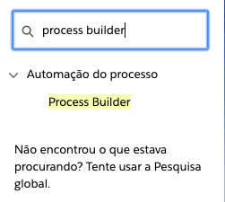
    
    Process Builder

Após encontra-los, basta clickar na seta para expandir as opções e selecionar "Desativar". Para que a desinstalação tenha sucesso é necessário que todos os Process Builders sejam desativdos.

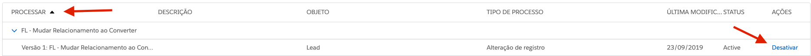
    
    Desativação do Process Builder
    
Será necessário também remover o metadado Parâmetro Global. O Parâmetro Global pode ser encontrado pesquisando por "Metadado" na barra de pesquisa na Configuração

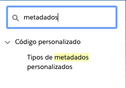
    
    Metadados "Gerenciar Registros" ao lado do Parâmetro Global. 
    
Nos metadados, deve ser selecionado o botão "Gerenciar Registros" que se encontra ao lado do metadado Parâmetro Global     
    
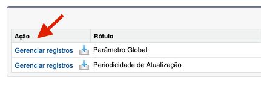
    
    Gerenciar Registros do Parâmetro Global
    
Ao selecionar a opção, dois registros serão mostrados em tela, ambos precisam ser excluídos para que a desinstalação seja possível

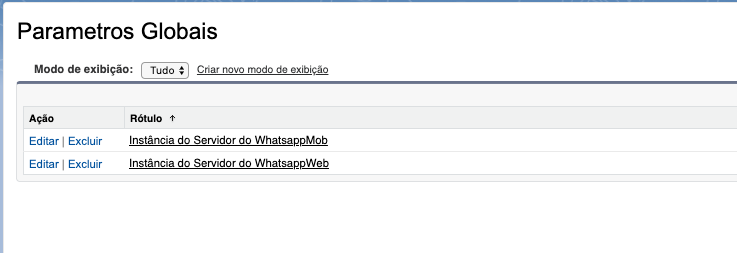
    
    Instancias do servidor Mob e Web

Após a realização da exclusão do Parâmetro Global, será necessária a exclusão dos dados do Site Remoto

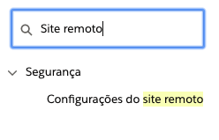
    
    Site Remoto
        
No site remoto deve-se exclui ambos os registros, WhatsappMob e WhatsappWeb.

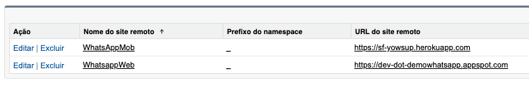
    
    Exclusão do Site Remoto
 
Estes são os padrões, entretanto pode-se encontrar algumas outras dependencias do pacote caso o mesmo já tenha sido customizado, como por exemplo um campo do falae sendo utilizado em um Layout padrão

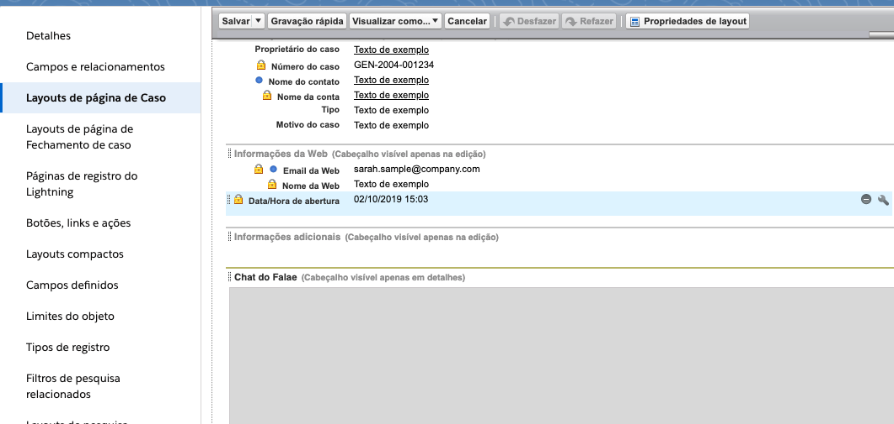
    
    Campo do Falae no Objeto Caso
    
Os campos são facilmente removidos arrastando-os de volta para a barra superior    
  
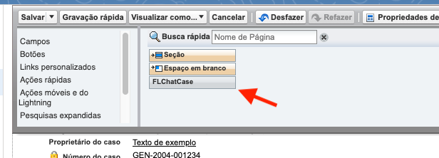
    
    Remoção do campo
 
Podem também haver Layouts implantados e estes também precisam ser removidos, para remove-los é necessário acessar o Objeto através do Gerenciador de Objetos e ir na aba de Layout 
 
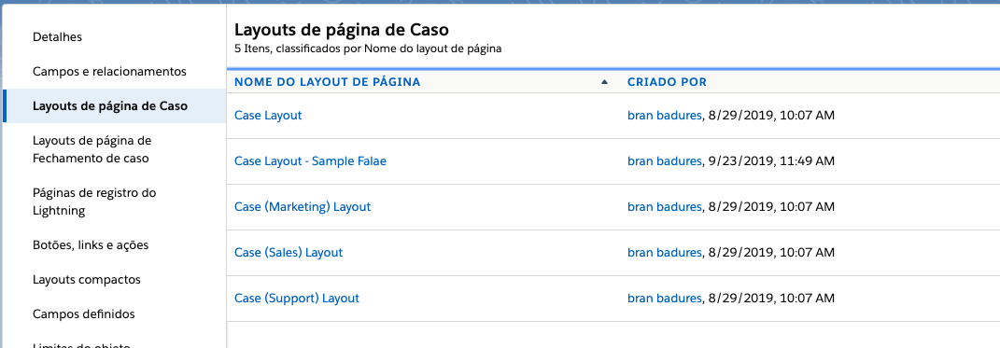
    
    Layouts Customizados nos Objetos
 
Depois da remoção das dependencias a desinstalação pode ser realizada através dos Pacotes Instalados e para acessa-lo basta entrar em Configuração e procurar por "Pacotes Instalados"

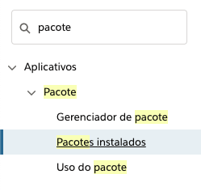
    
    Pacotes Instalados

No Pacotes Instalados é possível visualizar todos os pacotes instalados em sua organização, além de poder desinstalados. Para a desinstalação é necessário selecionar a ação "Desinstalar"

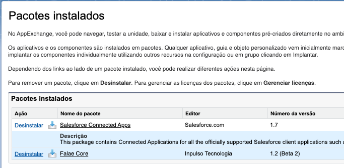
    
    Desinstalação
    
No final da página será necessário marcar a opção confirmando que deseja desinstalar permanentemente os componentes e clickar no botão "Desinstalar"

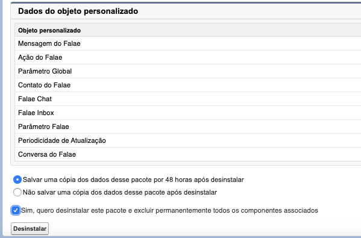
    
    Confirmação da Desinstalação
    
